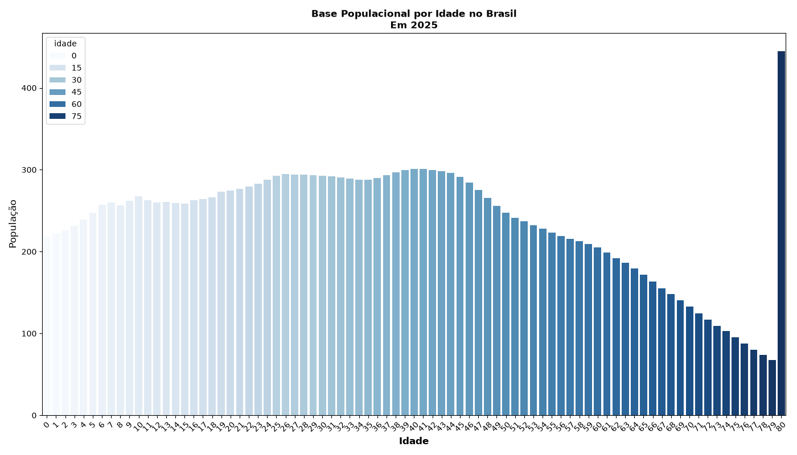
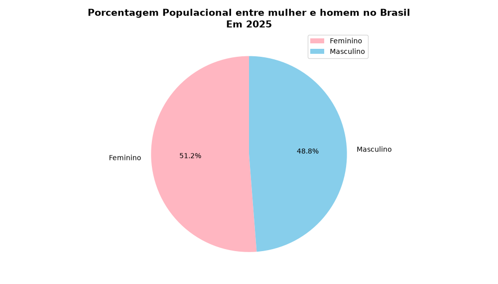

## Hi there 👋
## Sou o Alex, Apaixonado em tecnologia, Python e começando em análise de dados

## Projeto de análise de dados do IBGE
Este projeto tem como objetivo **analisar grandes quantidades de dados do IBGE**, realizar a **limpeza para evitar duplicatas** e gerar **gráficos ilustrativos** que ajudam a compreender melhor os detalhes solicitados.

## Tecnologia utilizadas
- Python (Pandas, Numpy, Matplotlib, Seaborn)
- Git & GitHub
  
## Funcionalidades
- Importação dos dados do IBGE
- Limpeza e Tratamentos de dados sem valores
- Criação de Gráficos
- Salvamento dos Gráficos
- Convertendo para valores numéricos
- Visualização clara dos resultados

## Exemplos de Gráficos
1. **Base Populacional por Idade no Brasil Em 2025**
   - O Gráfico 1 mostra a estimativa da população brasileira por idade em 2025. A principal relevância desse resultado é indicar que a população está envelhecendo. Isso significa que há menos jovens e mais pessoas em faixas etárias mais altas, o que reflete mudanças importantes na sociedade, como a queda da natalidade e o aumento da expectativa de vida. Essa tendência traz impactos para áreas como saúde, previdência e mercado de trabalho, já que o Brasil precisa se preparar para atender uma população cada vez mais madura.
  
3. **Porcentagem Populacional por sexo no Brasil Em 2025**
   - O Gráfico 2 ilustra a porcentagem da população brasileira por sexo em 2025. A análise mostra um aumento na população masculina em relação a 2024 e uma redução na população feminina. Essa variação, ainda que pequena, é relevante porque evidencia mudanças na composição demográfica do país. Alterações na proporção entre homens e mulheres podem ter impactos em áreas como mercado de trabalho, saúde e políticas sociais, reforçando a importância de acompanhar essas tendências ao longo do tempo.
  

## Como executar
  - ```bash
    git clone ## Hi there 👋
## Sou o Alex, Apaixonado em tecnologia, Python e começando em análise de dados

## Projeto de análise de dados do IBGE
Este projeto tem como objetivo **analisar grandes quantidades de dados do IBGE**, realizar a **limpeza para evitar duplicatas** e gerar **gráficos ilustrativos** que ajudam a compreender melhor os detalhes solicitados.

## Tecnologia utilizadas
- Python (Pandas, Numpy, Matplotlib, Seaborn)
- Git & GitHub
  
## Funcionalidades
- Importação dos dados do IBGE
- Limpeza e Tratamentos de dados sem valores
- Criação de Gráficos
- Salvamento dos Gráficos
- Convertendo para valores numéricos
- Visualização clara dos resultados

## Exemplos de Gráficos
1. **Base Populacional por Idade no Brasil Em 2025**
   - O Gráfico 1 mostra a estimativa da população brasileira por idade em 2025. A principal relevância desse resultado é indicar que a população está envelhecendo. Isso significa que há menos jovens e mais pessoas em faixas etárias mais altas, o que reflete mudanças importantes na sociedade, como a queda da natalidade e o aumento da expectativa de vida. Essa tendência traz impactos para áreas como saúde, previdência e mercado de trabalho, já que o Brasil precisa se preparar para atender uma população cada vez mais madura.
  
3. **Porcentagem Populacional por sexo no Brasil Em 2025**
   - O Gráfico 2 ilustra a porcentagem da população brasileira por sexo em 2025. A análise mostra um aumento na população masculina em relação a 2024 e uma redução na população feminina. Essa variação, ainda que pequena, é relevante porque evidencia mudanças na composição demográfica do país. Alterações na proporção entre homens e mulheres podem ter impactos em áreas como mercado de trabalho, saúde e políticas sociais, reforçando a importância de acompanhar essas tendências ao longo do tempo.
  

## Como executar
  - ```bash
    git clone 
    ```
